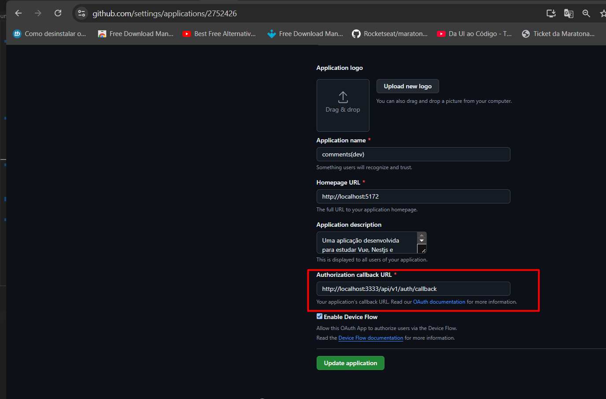
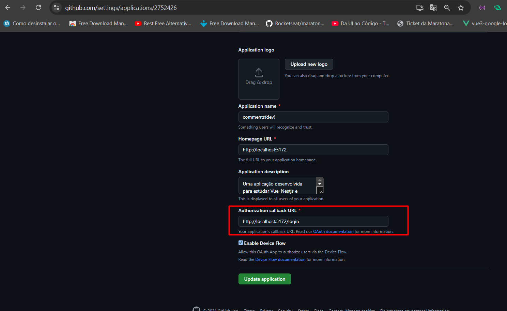

# Vue 3 + TypeScript + Vite

## Instale as extensões para pegar a sintaxe do vue

#### Nome: Vue 3 Snippets
```
{
  ID: hollowtree.vue-snippets
  Descrição: A Vue.js 3 And Vue.js 2 Code Snippets Extension
  Versão: 1.0.4
  Editor: hollowtree
  Link do Marketplace do VS: https://marketplace.visualstudio.com/items?itemName=hollowtree.vue-snippets
}
```

#### Nome: Vue - Official
```
{
  ID: Vue.volar
  Descrição: Language Support for Vue
  Versão: 2.1.6
  Editor: Vue
  Link do Marketplace do VS: https://marketplace.visualstudio.com/items?itemName=Vue.volar
}
```
### Nome: Vetur TypeScript performance workaround
```
{
  ID: snovakovic.vtpw
  Descrição: Workaround for the performance issues with vetur plugin when used in combination with TypeScript
  Versão: 0.1.2
  Editor: Stefan Novakovic
  Link do Marketplace do VS: https://marketplace.visualstudio.com/items?itemName=snovakovic.vtpw
}
```

### Se necessário: Nome: Vue Extension Box. 

Extensão de pacote para ajudar no vue. Se não precisar do sass pode instalar as outras independentemente ou instale a extensão toda e depois desinstale a extensão de sass. Se você usa o prettier sem o eslint pode deixar a extensão instalada, se não, pode desinstalar ela também ou desabilitar. No meu caso vou usar o eslint e o prettier dentro do eslint.

```
{
  ID: MisterJ.vue-volar-extention-pack
  Descrição: This extension packs uses the latest vue extension that really works well with different vue projects.
  Versão: 2.0.8
  Editor: BroJenuel
  Link do Marketplace do VS: https://marketplace.visualstudio.com/items?itemName=MisterJ.vue-volar-extention-pack
}
```

### Extensão no google chrome: [Vue.js devtools](https://chromewebstore.google.com/detail/vuejs-devtools/nhdogjmejiglipccpnnnanhbledajbpd)

## Alguns videos/docs que me ajudaram

- [Vue 3 + TypeScript + Vite](https://vite.dev/guide/)
- [Vue 3 + TypeScript + Vite](https://www.youtube.com/watch?v=zZziykF3ks4)

- [shadcn-vue(Parecido com o shadcn-ui do react)](https://www.shadcn-vue.com/docs/installation/vite)
  - [Uma lib parecida com radix-ui do react, diferença que adaptada pra vue](https://www.radix-vue.com/overview/getting-started.html)
- [TailwindCss, mesmo framework css para React](https://tailwindcss.com/docs/guides/vite#vue)

- [Eslint para vue 3 - Eslint no Vue 3 | Como configurar o eslint no vue 3](https://www.youtube.com/watch?v=rMoHmWZXySM)

## Sequencia de instalação

### Config

- npm create vite@latest
 - Nome para o projeto
 - Selecione o projeto que deseja instalar. Nesse caso vue
 - TypeScript
 - ```npm i``` para instalar as dependências

- Exclua arquivos desnecessários

- Instale as extensões necessárias do vue no VsCode

- ```npm run dev``` para iniciar o servidor

- npm i -D tailwindCss autoprefixer postcss
  - Config para o tailwindcss:
    ```js
      export default {
        content: [
          "./index.html",
          "./src/**/*.{vue,js,ts}",
        ],
        theme: {
          extend: {},
        },
        plugins: [],
      }
    ```
  - configure o style.css dentro de src, mude o nome para main.css. Em main.ts mude o nome da importação do css principal de toda a aplicação, para main.css
    - Dentro do main.css coloque o que esta no nosso arquivo main.css. Que são coisas necessárias para o tailwindcss rodar.

  - Configure o vite como esta no vite.config.ts dessa pasta.
    - npm install @types/node --save-dev
    - Coloque o postcss em css e os plugins do postcss: plugins: [tailwind(), autoprefixer()]
    - Coloque os mappings para os arquivos do vue:
    ```ts
        resolve: {
          alias: {
            // npm install @types/node --save-dev para pegar o alias __dirname
            '@': path.resolve(__dirname, './src'),
          },
        },
    ```
  - Crie mappings para os arquivos do vue
    - Crie ```tsconfig.paths.json```
    - Depois em ```tsconfig.app.json``` coloque: 
    ```Json
       "extends": "./tsconfig.paths.json"
    ```
- Configurando o eslint V8(V9 ta diferente e estranho). Pode copiar o arquivo eslint para vue para o seu projeto, como está aqui na pasta raiz.
  - Lembre de copiar e usar o .vscode daqui da pasta, para o Eslint funcionar
  - Para iniciar um novo arquivo eslint:
  ```
    npx eslint --init
    Enter
    To check syntax and find problems
    JavaScript modules (import/export)
    Vue.js
    Does your project use TypeScript? Yes(Isso para projetos como o meu que está trabalhando com TS, se não, marque No)
    Where does your code run? Selecione: Browser e Node(So dar barra de espaço para marcar ou desmarcar)
    What format do you want your config file to be in? Javascript ou sua preferencia

    The config that you've selected requires the following dependencies:
    eslint, globals, @eslint/js, typescript-eslint, eslint-plugin-vue
    Would you like to install them now? Yes 

    Which package manager do you want to use? NPM/Yarn... sua preferencia
    
    E pronto ele vai criar um arquivo de config do eslint 
  ```
    - npm i eslint eslint-config-prettier eslint-plugin-prettier prettier eslint-plugin-vuejs-accessibility eslint-plugin-import -D
      - npx eslint --init --> Com isso ele ira criar uma config do eslint, instalar demais dependencias. E se você quiser, pode colocar mais plugins e rules(O meu arquivo já está do jeito que eu quero com o prettier e com eslint-plugin-vuejs-accessibility que é tipo o jsx-a11y do react) 

  - [Docs - eslint-plugin-vue](https://eslint.vuejs.org)
  - [Docs - eslint-plugin-vuejs-a11y](https://vue-a11y.github.io/eslint-plugin-vuejs-accessibility/)

  - [No fim eu fiz um pacote npm da minha config eslint](https://www.npmjs.com/package/@pedrohvfernandes/eslint-config-vue). Basicamente eu faço a config do eslint antes em algum projeto vue/react, vejo se esta corrigindo os erros(fiz isso para o react, next e node também), e depois eu crio um pacote com essas configs, para depois no projeto que foi criado a config eslint enorme so extender essas configs no arquivo .eslintrc.json, que antes era um .eslintrc.cjs com as configs, agora nada mais é que um JSON estendendo o meu arquivo vue.js do meu pacote ```npm i @pedrohvfernandes/eslint-config-vue``` que era .eslintrc.cjs 

  - Agora instale: ``` npm i husky git-commit-msg-linter -D``` na raiz do projeto. Primeiro porque o husky precisa ter acesso ao .git do projeto, ou seja, so na raiz do projeto temos acesso ao .git onde fica os hooks. Então pode ser aqui na web-vue e nem na pasta de api. E o git-commit-msg-linter porque iremos fazer commit pelo terminal da raiz

  - Depois instale nesse projeto do front: ``` npm i lintstagedrc -D``` e crie o arquivo ```lintstagedrc.json```

  - Por ultimo crie um vercel.json com o seguinte formato:
  ```json
    {
      "rewrites": [{ "source": "/(.*)", "destination": "/" }]
    }
  ```
  Para caso você use o vercel para publicar seu projeto.

  ### Configurando componentes usando a lib shadncn-vue(igual a shadcn-ui do react)

  - [Docs - Shadcn-vue](https://www.shadcn-vue.com/docs/installation/vite)
    - De um ```npx shadcn-vue@latest init```
      - O que eu selecionei
        ```
        npx shadcn-vue@latest init
        Need to install the following packages:
        shadcn-vue@0.10.5
        Ok to proceed? (y)
        √ Would you like to use TypeScript? (recommended)? ...yes
        √ Which framework are you using? » Vite
        √ Which style would you like to use? » New York
        √ Which color would you like to use as base color? » Slate
        √ Where is your tsconfig.json file? ... ./tsconfig.json
        √ Where is your global CSS file? (this file will be overwritten) ... src/assets/index.css
        √ Write configuration to components.json. Proceed? ... yes
        ```

    - Depois de um ```npx shadcn-vue@latest add```, de um ```ctrl+a+space``` para selecionar todos os componentes e de enter para a lib criar esses componentes.

    - Ou ```npx shadcn-vue@latest add button``` para adicionar um componente especificio 

    - Ele ira gerar o arquivo ```components.json```
    Você tem que ter criado o mapping paths no tsconfig.json. Porque ele usa, para saber onde colocar os componentes da lib e os utilitários
    ```json
      "aliases": {
      "components": "@/components",
      "utils": "@/lib/utils"
     }
    ```
## Links que me ajudaram

  ### [Sistema de rotas Vue](https://chatgpt.com/c/670581be-0058-8010-a5b0-a8e523a0a9c6)

  ### [Vue 3 Props e Defaults](https://chatgpt.com/c/6705dcc5-4ddc-8010-8120-30d668d1dfcf)

  ### [Utilizando o SVG como um componente no Vue e Vite](https://wallacemaxters.com.br/blog/101/utilizando-o-svg-como-um-componente-no-vue-e-vite#google_vignette)

  ### [Atualização de item Vue](https://chatgpt.com/c/6723f9bd-0a3c-8010-b122-4f58f3a61cfb)
  
  ### [Atualização com Vue Query](https://chatgpt.com/c/67222dc8-d554-8010-bd62-87e7b9db4361)

  ### [Correção de mutação Vue](https://chatgpt.com/c/67212e6f-090c-8010-bac9-6d6afb6c9430)

  ### [NestJs e mongodb](https://chatgpt.com/c/670f718a-e64c-8010-8abc-c4ac966718d9)

  ### [Atualização de Comentário API](https://chatgpt.com/c/67207544-f8ac-8010-a8c4-84ae3e53d11e)

  ### [Truncar nome usuário responsivo](https://chatgpt.com/c/671fcf09-c8b0-8010-bfc8-866038b35025)

  ### [Autenticação Vue Query Ajustes](https://chatgpt.com/c/671f3e46-81ec-8010-8a12-a9f2f897fc0c)

  ### [Botão com Ícones Responsivos](https://chatgpt.com/c/671fac43-9554-8010-bb4f-05d43d316f77)

  ### [URL de callback de autorização](https://chatgpt.com/c/671b5254-1230-8010-9524-8d34eb7d5158)

  ### [Atualização com TanStack Vue](https://chatgpt.com/c/6725dfcb-bb10-8010-8fd6-72f7e8d80fe1)

  ### [Atualização seletiva com TanStack](https://chatgpt.com/c/67248fef-cee0-8010-bad7-2e591d2e977b)

  ### Erro na vercel, do deploy usando o Npm e vite: Error: Cannot find module @rollup/rollup-linux-x64-gnu

  Solução:
  ```json
    "overrides": {
      "vite": {
        "rollup": "npm:@rollup/wasm-node"
      }
  },
  ```
  Mais soluções:
    - [Solução 1](https://github.com/vitejs/vite/issues/15167)
    - [Solução 2](https://stackoverflow.com/questions/77569907/error-in-react-vite-project-due-to-rollup-dependency-module-not-found)


### [Vue 3 | O básico para você iniciar com o Vue 3](https://www.youtube.com/watch?v=xS9KVesgQ28)
  - v-model
  - refs e reactive
  - v-if --> Criando outra template dentro de outra, para por exemplo mostrar um email na tela, caso o usuario tenha colocado um email no input e email. É tipo um ternario do react
    - Ex: ```<template v-if="user.email.length"> <p>Email vazio</p> </template>``` --> Aí esse template vai dentro de outro template, e só vai aparecer se o email do usuario for maior que 0
  - v-else --> Se o v-if não for verdadeiro, ele vai mostrar o que esta dentro do v-else: Ex: ```<template v-else> <p>Email: {{user.email}}</p> </template>```
  - onMounted --> É tipo o useEffect do react, ele é chamado quando o componente é montado
  - form
  - v-for --> lista de itens, tipo o map do react
  - Botão com evento click para remover um item da lista -->  v-on
    - findIndex para achar o index do item que queremos remover
    - splice para remover um item da lista
  - Usando tailwindcss

### [Estrutura da composition api | Composition API Vue 3](https://www.youtube.com/watch?v=QmRbcU2OwrM)

### [VueJS em 1 hora! (Teoria e prática)](https://www.youtube.com/watch?v=cSa-SMVMGsE)
  - O v vem de vue, e o bind é para ligar um valor a um atributo do html
  - Propriedade data, que é uma função que retorna um objeto, e esse objeto é o que vai ser renderizado na tela
  - template
  - interpolacao
  - diretivas
    - v-for
    - v-bind
    - v-if e v-else
    - v-on
    - v-bind --> é uma diretiva para fazer ligação de dados com o template
    - v-bind:key --> Para o v-for, para o vue saber qual item ele tem que renderizar, qual item mudou dentro dessa lista, se removeu, modificou, ou adicionou novo item... Tipo no .map no react.
    - diretiva:nomeDoEvento(argumento).modificador, ex: v-on:click.prevent --> Esse prevent é para previnir o comportamento padrão do html, o famoso preventDefault
  - data binding --> Two way data binding --> Mão dupla
    - v-model --> Para fazer o two way data binding, ele liga o valor do input com o valor da variavel, refletindo nom meu model
  - Uma maneira diferente de dar preventDefault no vue, é usar o .prevent no evento
  - computed properties --> Propriedades computadas --> Essa propriedade/função, disponibiliza variaveis, valores para serem renderizados no template. propriedade da tag script: 
  ```js
    computed:{
      cria uma propriedade/função computada
    } 
  ```
  ou função `const isFirstPage = computed(() => refPagination.page <= 1)` --> Essa função vai ser chamada toda vez que o valor de refPagination.page mudar, e ela vai retornar true ou false, dependendo do valor de refPagination.page
  - Ex: Em um sistema de comentario, onde o usuario preenche seu nome no momento que esta escrevendo o comentario, caso ele não escreva eu quero que apareça "Anônimo" no lugar do nome dele. Então eu posso usar uma computed property para fazer isso, e ela vai ficar observando o valor do nome do usuario, e caso ele não escreva nada, ela vai retornar "Anônimo", mas no banco de dados vai ser salvo como null, ou seja, o valor do nome do usuario vai ser null, mas na tela vai aparecer "Anônimo"
  - Outra propriedade/função de reatividade é o watch, que é para observar uma variavel e fazer algo quando ela mudar. Ela monitora uma variavel e executa uma função toda vez que essa variavel mudar.
    - Ex: `watch(() => refPagination.page, (newPage, oldPage) => {console.log(newPage, oldPage)})` --> Essa função vai ser chamada toda vez que o valor de refPagination.page mudar, e ela vai retornar o novo valor e o valor antigo. Ou tu pode passar assim como propriedade da tag script:
    ```js
      watch: {
        <!-- 
        
          Basicamente é assim que se usa o watch, você passa uma variavel que vai ser observada, ela vira uma função, ou seja, se eu tenho uma variavel que se chama `comments`, então eu passo pro watch `comments(val)` e a propriedade dentro `val` captura a mudança, e toda vez que essa variavel mudar, a função vai ser chamada. E essa função vai receber o novo valor e o valor antigo da variavel que esta sendo observada.
        -->
        nomeDaVariavelQueVaiSerObservada(val){ 
          console.log('Mudou', val)
        }
      }
    ```
  - Single file components --> SFC --> É um arquivo que contem o template, script e style, tudo em um arquivo só, tipo react que tem o jsx, o css e o js tudo em um arquivo só
  - Redux ou Vuex --> É um gerenciador de estado global, que serve para compartilhar dados entre componentes, e ele é muito usado em aplicações grandes, onde tem muitos componentes que precisam compartilhar dados entre si. Tipo o contexto do react, mas o vuex é mais poderoso, ele é mais parecido com o redux do react. Tem o vue router para gerenciar as rotas, e o vuex para gerenciar o estado global da aplicação.
    - O Vue Router é uma biblioteca para roteamento e o Vuex é uma ferramenta para gerenciamento de estado centralizado no Vue.js:
    - Vue Router
      - É a biblioteca oficialmente suportada para a maioria das Single Page Applications (SPAs). O Vue Router permite adicionar e proteger rotas, e oferece recursos como navegação via código, parâmetros de rotas, redirecionamento, entre outros.
    - Vuex
      - É uma ferramenta para gerenciamento de estado centralizado, que permite fazer o gerenciamento de estado de forma centralizada.     
    O Vue.js é um framework que oferece bibliotecas principais e suporte para a construção de SPAs. A Vue 3 é a versão principal mais recente do Vue.
    - [Vue Newbie: What is the diff between Vue Router and Vuex? Is Vuex better? When to use Vue Router and Vuex? Should I use both?](https://www.reddit.com/r/vuejs/comments/l18ss8/vue_newbie_what_is_the_diff_between_vue_router/)
  - Emit(min 47) --> É um evento personalizado, que é emitido por um componente filho, e capturado por um componente pai. É tipo o evento do react, que é emitido por um componente filho e capturado por um componente pai. Ele é usado para passar dados de um componente filho para um componente pai. Ex: dentro do componente filho: `this.$emit('nomeDoEvento', {dados que eu quero passar para o pai})` --> Esse evento é capturado pelo componente pai, e ele pode pegar os dados que foram passados pelo evento, e fazer o que ele quiser com esses dados, por exemplo dentro do forms, v-on:nomeDoEvento="metodo" --> esse metodo do pai vai ser passado para o filho, atraves do evento que o filho emitiu, e o pai vai poder pegar os dados que o filho passou, e fazer o que ele quiser com esses dados. E toda vez que esse evento for chamada, o metodo do pai vai ser chamado, e ele vai receber os dados que o filho passou.

### [Dark & Light Mode With Vue, VueUse & Tailwind CSS](https://www.youtube.com/watch?v=7_mqThfC_yM)
### [Adding a Dark Mode to Vue in 5 Minutes](https://www.youtube.com/watch?v=cGN91TLXrC8)
  - [Docs VueUse](https://vueuse.org/guide/)

### Ideias
  - [Tailwind CSS Headings - Flowbite](https://flowbite.com/docs/typography/headings/)
  - Cards comments
    - [6 Tailwind Comment Components](https://freefrontend.com/tailwind-comments/)
    - [Tailwind CSS Comments Sections](https://pagedone.io/blocks/e-commerce/comment-list)
    - [Tailwind CSS Comments Sections - Flowbite](https://flowbite.com/blocks/publisher/comments/)
  -[Botão Logout com Ícones Responsivos](https://chatgpt.com/c/671fac43-9554-8010-bb4f-05d43d316f77)

### [Pagination e tanstack query](https://www.youtube.com/watch?v=0Njxq9UcL9s)
  - [Tanstack Query](https://tanstack.com/query/v5/docs/framework/vue/overview)
    - [Updates from Mutation Responses](https://tanstack.com/query/latest/docs/framework/vue/guides/updates-from-mutation-responses)
    - [Optimistic Updates](https://tanstack.com/query/latest/docs/framework/vue/guides/optimistic-updates)
    - [How to use the react-query.queryCache.setQueryData function in react-query](https://snyk.io/advisor/npm-package/react-query/functions/react-query.queryCache.setQueryData)
    - [QueryData](https://tanstack.com/query/latest/docs/reference/QueryClient?from=reactQueryV3#queryclientsetquerydata)
    - [getQueryData é sempre indefinido](https://github.com/TanStack/query/discussions/420)
    - [Vue Query](https://vue-query.vercel.app/#/,)

### Removedor de palavrão
 - [I Made a JavaScript Library that Leaves Profanity Speechless!](https://dev.to/best_codes/how-i-built-a-profanity-blocking-javascript-library-f8f)
  - [Profanity Filter](https://github.com/2Toad/Profanity)

### Meus projetos que me ajudaram
  - [nlw-unite](https://github.com/PedrohvFernandes/nlw-unite/tree/main)
    - Route Params
    - [Fazendo um Pagination no back-end](https://github.com/PedrohvFernandes/nlw-unite/blob/main/api/src/routes/get-event-attendees.ts)
    - [Pegando o Pagination do front e usando ele no front-end](https://github.com/PedrohvFernandes/nlw-unite/blob/main/pass-in-web/src/components/attendee-list.tsx)
  - [cupcakes](https://github.com/PedrohvFernandes/cupcakes/blob/main)
    - Config IsDev
  - [controle-de-metas](https://github.com/PedrohvFernandes/controle-de-metas/tree/main)
    - UseQuery
  - [react-practice](https://github.com/PedrohvFernandes/react-practice/tree/main)
    - Pagination
    - UseQuery
    - Route Params

### Error na vercel por conta do dayjs locale/pt-br
  - Error: 
  ```
  [vite]: Rollup failed to resolve import "dayjs/locale/pt-BR" from "/vercel/path0/web-vue/src/utils/date-formatted.ts".
  This is most likely unintended because it can break your application at runtime.
  If you do want to externalize this module explicitly add it to
  `build.rollupOptions.external
  ```
  - [Solução](https://stackoverflow.com/questions/71552229/vite-how-do-i-use-a-wildcard-in-rollupjs-build-rollupoptions-external)
  No arquivo do vite.config.ts:
  ```ts
    build: {
      rollupOptions: {
        external: [
          'dayjs/locale/*' ou 'dayjs/locale/pt-BR'
        ]
      }
    }
  ```

  Depois mude os imports do dayjs:
  ```ts
    import dayjs from 'dayjs'
    import 'dayjs/locale/pt-BR'
  ```

  para

  ```ts
    import dayjs from 'dayjs/esm'
    import 'dayjs/esm/locale/pt-br'
  ```

  ### [Outras pesquisas que eu fiz](https://chatgpt.com/c/6707658f-ed84-8010-a130-8d288c50d513)

  ## Fazendo OAuth com o GitHub
  - [Video que me ajudou - Da UI ao Código - Ticket da Maratona Explorer](https://www.youtube.com/watch?v=qDerqzmELx8)
    - [Profile Settings](https://github.com/settings/profile)
      - Developer settings
        - OAuth Apps
          - New OAuth App
            - Application Name: Create two applications, one for development and one for production
            - Homepage URL
            - Authorization callback URL
            - Register application
          - Exist Application: Enter your application
            - Client ID
            - Client Secret
              - Generate a new client secret or Regenerate client secret: Generate a new client secret, delete the old one and put the new one in the .env
                  
        - [Developer Settings](https://github.com/settings/developers) --> Entre ou crie uma nova aplicação(New OAuth App). Passe o Application Name, Homepage URL e Authorization callback URL --> Url de quando o usuário é redirecionado após autorizar o acesso, no caso um rota do back-end ou front, eu usei back, para poder manipular as informações do usuario dentro do meu banco de dados.
          - Ex das minhas aplicações e as urls de redirecionamento: comments(dev) --> http://localhost:5172 e http://localhost:3333/api/v1/auth/callback, comments(prod) --> https://comentarios-nine.vercel.app e https://comen.../api/v1/auth/callback
    - Envs, passe o client_id e o client_secret, no modo dev pegar esses dois valores do application [comments(dev)](https://github.com/settings/applications/2752426) e passe para o arquivo .env daqui, para prod na vercel pegar esses dois valores do application [comments](https://github.com/settings/applications/2752473) e passe para ela.
    ```
      VITE_GITHUB_CLIENT_ID=seu_client_id
      VITE_GITHUB_CLIENT_SECRET=seu_client_secret
    ```
    - Aqui no front eu crio um link assim: `https://github.com/login/oauth/authorize?client_id=${ConfigBases.comments.gitHub.oauth.clientId}`

  - [Docs OAuth GitHub](https://docs.github.com/pt/developers/apps/building-oauth-apps/authorizing-oauth-apps)
  - [Botão de login do GitHub](https://docs.github.com/pt/enterprise-cloud@latest/apps/creating-github-apps/writing-code-for-a-github-app/building-a-login-with-github-button-with-a-github-app)
    - Se a gente quiser, em vez dele redirecionar diretamente para o nosso back-end http://localhost:3333/api/v1/auth/callback, ele pode voltar para o nosso front com o codigo http://localhost:5172/login?code que antes ele passava para a rota do nosso back-end diretamente, e com isso via params, pegamos o coidgo e passamos para o nosso back-end(api/v1/auth/callback?{code}). "A mas antes passava direto no redirecionamento do github no Authorization callback URL", verdade, mas não conseguíamos por exemplo pegar o retorno dela, o loading... porque no fim o redirecionamento estava direto, era o github que ia no nosso back-end. Claro que no nosso back-end na rota auth eu poderia fazer um redirecionamento com as informações dos usuarios logados na rota como params, so que ficaria quase impossivel de manipular essas infos no front, sem falar que por exemplo eu não teria um loading.
      - Então agora eu ainda vou continuar tendo o link do git, que ao clicar me leva para o github, so que apos autorizar ele me devolve um codigo para o meu front, que com isso eu manipulo ele no meu back-end diretamente, podendo pegar as informações do usuario logado, pegar o loading... de http://localhost:3333/api/v1/auth/callback para http://localhost:5172/login no Authorization callback URL(isso fica onde você cria a aplicação no github), que agora ao clicar no link e autorizar ele volta assim http://localhost:5172/login?code=7f3b8ec7c025e9205aba, que antes era assim http://localhost:3333/api/v1/auth/callback?code=7f3b8ec7c025e9205aba --> Diretamente no back-end, agora no front.
        <div style="display: flex; justify-content: space-between;">

          <div style="display: flex; flex-direction: column; justify-content: space-between; margin-right: 10px;">
          <h4>Antes: Diretamente No back</h4>
          
          </div>
          
          <div style="display: flex; flex-direction: column; justify-content: space-between;">
          <h4>Depois: No front(Melhor opção para mim)
          
          </h4>
          
          </div>
      </div>
    - [Context - Composables](https://www.youtube.com/watch?v=9dqbl_0A0P4)
      - [Composition Api](https://vuejs.org/api/composition-api-setup.html#setup-context)
      - [Autenticação Vue Query Ajustes](https://chatgpt.com/c/671f3e46-81ec-8010-8a12-a9f2f897fc0c)
      - [Persistir dados com React](https://tanstack.com/query/latest/docs/framework/react/plugins/createSyncStoragePersister)
      - [Persist Data With Vue 3](https://dev.to/grahammorby/persist-data-with-vue-3-38pc)
      - [Entenda como funciona o sistema de cache do react-query](https://www.youtube.com/watch?v=YmS5uo9ty2Q)
      - [REACT QUERY - Como usar o React Query para armazenar e manipular dados do servidor em cache](https://www.youtube.com/watch?v=lgHnanYVXBw)
      - [Usar React Query ou armazenar em cache no backend?](https://www.reddit.com/r/reactjs/comments/152iw5y/using_react_query_or_cache_it_in_the_backend/?tl=pt-br)

## Possível feature: websocket para receber os comentarios em tempo real

  - [Demystifying NestJS WebSocket Gateways: A Step-by-Step Guide to Effective Testing](https://dev.to/jfrancai/demystifying-nestjs-websocket-gateways-a-step-by-step-guide-to-effective-testing-1a1f)
  - [NestJS Websockets](https://docs.nestjs.com/websockets/gateways)
  - [Nest JS Websockets - Basics](https://www.delightfulengineering.com/blog/nest-websockets/basics)
  - [Building Real-time Applications with Nest.js and WebSockets](https://javascript.plainenglish.io/building-real-time-applications-with-nest-js-and-websockets-2a7114dc4544)
  - [NestJS: A Guide to WebSocket Implementation](https://hrugvedprashantchavan.medium.com/nestjs-a-guide-to-websocket-implementation-655593fc73ab)
  - [useWebSocket - Vue](https://vueuse.org/core/useWebSocket/)